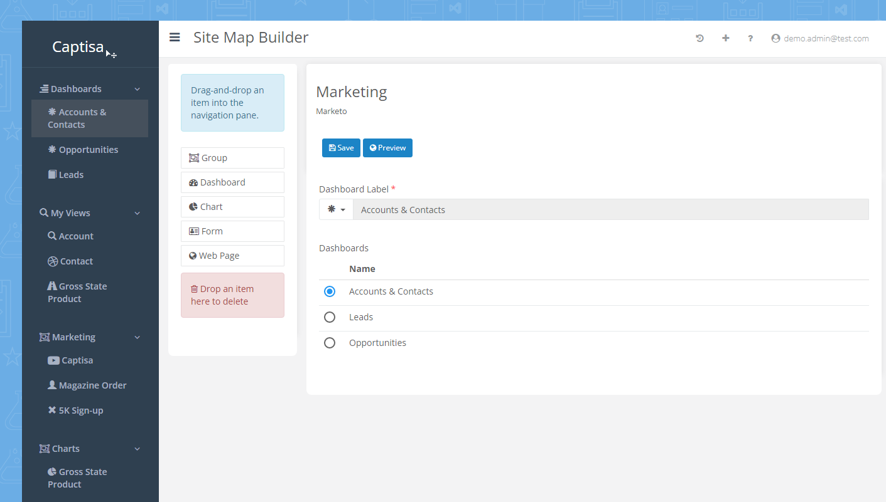

# Captisa Forms

### What is Captisa Forms?

**Captisa Forms** is an online form builder with database storage. Create free online forms with sub-forms, workflows, conditional logic, duplicate detection rules, multi-level select, lookup, repeating panels, tabs, and accordions.

Create views and filters, then use them to analyze your data through charts or pivot grids and present them in the dashboard.&#x20;

### Site Maps

Create **site maps** to define the navigation for your forms. By using a drag-and-drop site map designer, create a site map for your forms with ease. Use the designer to drag components onto the navigation pane and instantly publish the site map. The site map designer will also allow you to define the groups, dashboards, views, charts, and websites.&#x20;

### Guides: Jump right in

Follow our handy guides to get started on the basics as quickly as possible:


[dashboards.md](guides/dashboards.md)



[duplicate-forms.md](guides/duplicate-forms.md)



[Broken link](broken-reference)

