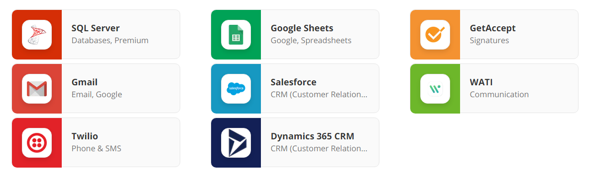
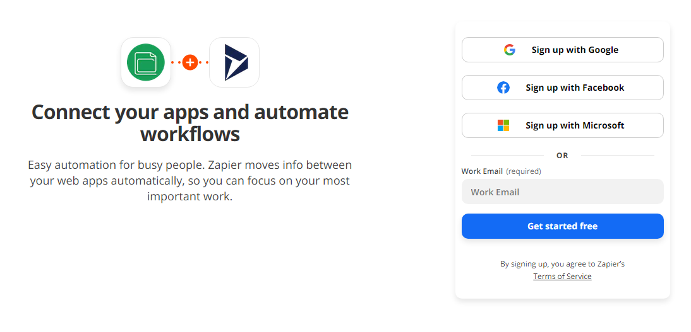
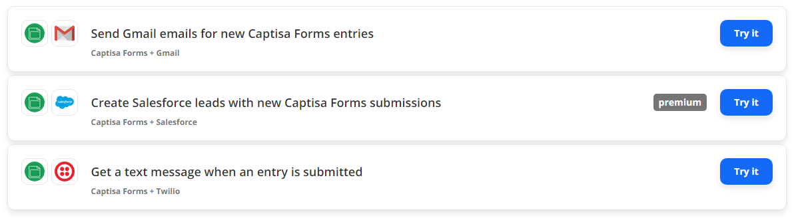
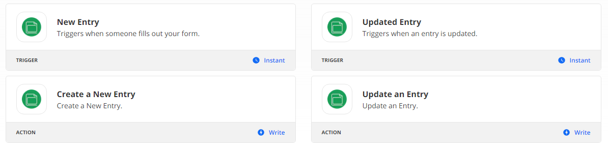

# Zapier

### Do more with Captisa Forms

Zapier lets you connect Captisa Forms with thousands of the most popular apps, so you can automate your work and have more time for what matters most—no code required.

### Connect your apps and automate workflows

### Popular ways to use Captisa Forms workflow

### Supported triggers and actions

